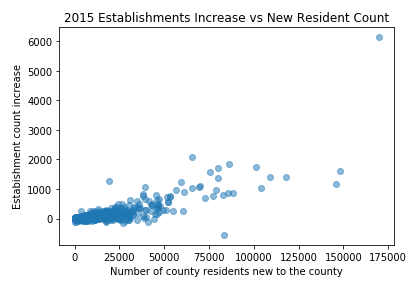
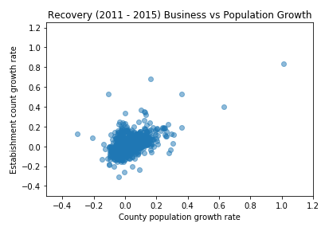

# Exploratory Data Analysis
[Notebook](https://github.com/raymondgh/springboard-data-science/blob/master/Capstone%201/ExploratoryDataAnalysis.ipynb)

## Objective

Visualizing the data enables insights beyond the summary statistics available with simple methods like .info() and .describe(). In the Exploratory Data Analysis notebook, a few attributes of interest are visualized across counties and time. It should be noted that the time-based analysis should not be treated with the same level of scrutiny as the snapshot views, as the data is _not_ time series data; there is no guarantee as too how many migrants originate and destine for a county within the year, nor how many businesses are started and closed down within the year. Only the totals are made available.

This brief exploration serves best as an overview of the data to be modeled. While a few conclusions can be drawn from the visualizations, nearly each pattern warrants additional exploration. For this summary-level analysis, exploration is kept broad and thin.

## Importing the Data

The data is imported as needed from the data/interim directory. All data has been keyed to geo_id, the unique US County and county equivalent identifier. Data is available for the years of 2005 through 2015. Analysis is done on the canonical 3,142 US counties represented in the Business Establishments and Employees files, not the divergent county lists in the population files.

## Analyzing it

The county data is overviewed for the most recent year of 2015 and for identified periods of interest representing the financial recession from 2007 through 2011 and subsequent recovery from 2011 through 2015. Visualizations are categorized into business focus, migration focus, and relationship focus. Matplotlib and Folium Python packages were used to create visualizations.

### Business

Business data includes total number of establishments and employees for each US county for the years 2005 through 2015.

#### Snapshot 2015

Data for the year 2015 represents the most recent available and relevant data to present the current state of affairs. Looking at establishment count only shows a predictable pattern of urbanization that concentrates the majority of business establishments in a a minority of US Counties

To show the extreme nature of the disparity between urban and rural business development, a box plot shows that the middle two quartiles are both hardly above 0 businesses. Most counties are economically small.

A log-based histogram better visualizes the spread. Los Angeles County skews the data tremendously, but the takeaway remains that counties with few establishments are an order of magnitude more common than those with more. Counties vary in geographical size, but they are not balanced by economic activity.

#### Country-wide trends

Looking at the same summary data of totals across industry, but combining counties to view by year, a line chart shows that the economic recession and financial collapse had measurable effects on local economies in the US. A net decrease of 361,682 business establishments across the country from 2007 to 2011 is preceded by a decrease in employment of 9,560,937 reported employees from 2006 to 2010. The subsequent increase in number of establishments is also preceded by an increase in employment. 

The economic recession from 2007 through 2011 displaced entrepreneurs and labor who reorganized in the recovery. The bar chart below shows industry distribution of establishments before and after. Retail trade decreased in popularity, but maintained its #1 rank. Construction establishments dropped significantly from 3rd most common to 6th. The biggest gains happened in the Professional, Scientific, and Technical Services, Health Care, and Accomodation & Food Services.

#### Trends within periods

Normalizing change in establishment counts by county gives the opportunity to measure growth rates as percentages. The box plot below shows the distribution of compound growth rates during periods of interest. In the recession, the fastest growing counties were found in Texas, North Dakota, South Dakota, Nevada, Nebraska, Alaska, Wisconson and Missouri. During the recovery, Texas dominates the outlier list, while Florida counties are most found in the third quartile. The biggest drops in the recession happened in Georgia, Nebraska, Oklahoma, and Utah. The biggest drops in the recovery happened in Missouri, Montana, Nevada and South Dakota.

Visualizing 2005-2015 with compound growth rates.

Visualizing 2007-2011 with compound shrinkage rates.

Visualizing 2011-2015 with compound growth rates.

### Migration

Migration data includes totals for inflow and outflow for each county regarding each county in the dimensions of tax returns (representing a household), tax exemptions (approximating number of people), and adjusted gross income (not visualized) for the years 2005 through 2015.

#### Country-wide trends

As a baseline to understand population in the US, tax exemptions filed can approximate number of people. However, tax filing is only required of those who generate income and are required to report to the IRS. A clear drop in number of exemptions filed breaks from a pattern of growth during the window of 2009-2013. This is likely a result of the economic downturn and resulting decrease in employment. The exemptions filed dip, however, occurs later than both the dip in number of establishments and number of reported employees. The line chart below shows total exemptions filed by year.

Examining only exemptions filed by residents new to their filing counties tells a different story. A decrease in this line shows both a decrease in overall filings as well as a decrease in mobility.

Plotting the line of exemptions by migrant filers as a percent of total exemptions filed tells a different story. From this third line chart, it can be seen that fewer people moved during the recession, yet that an even greater decrease in mobility can be observed in 2015.

#### County-local trends

Maps below explore the migration trends in the 2014-2015 filing years. The first shows each county colored by the percentage of residents that were new to the county in the year 2015. Despite vocal New Yorkers' complaints that too many people from Ohio move to the big apple, it can be seen that the midwest and southeast hold the counties most immigrated to from outside as a percentage of total people.. 

The same metrics are reproduced below with coloring based on migration origin rather than destination. The distribution is less polarized than the destination map, indicating that people moved to areas of interest in 2015 and leaving from all over. Many of the same areas exhibit the highest values, indicating high overall churn.

Normalizing by share of total migrants produces a less visually interesting display. Most people move to big cities.

By the same logic, it can be explained that most people are moving from big cities as well.

#### Overall

In summary, we can see that not all counties are growing in population. The map below indicates blue counties as exhibiting population growth and purple as shrinkage. The patterns here may indicate that many migrants are moving within state, as nearly every state has counties that both grew and shrank.

Population growth rate in 2015 is normalized by county in the map below. Florida must be atracting migrants from out of state, while a vertical stripe of migration in the west indicates significant reorganization, perhaps further west to the edge of Pacific and Mountain timezones.

### Business and Migration

Correlative analysis is kept simple for the data exploration and focus on the summary level data of total establishments and migrations.

#### Snapshot 2015

Exploring 2015 data on its own shows short term correlative data. The patterns are unexpectedly unpronounced, but there are many possible explanations. One hypothesis is that a migrant will settle in to a new community for more than a year before starting or helping to start a new business.

The first scatter plot shows how the rate of establishment growth relates to the ratio of residents who are new.

The second scatter plot shows how the net establishment increase relates to the total immigrant count.

The third scatter plot shows how the net population change relates to the net establishment increase

#### Periods

Looking at the data over longer periods of time indicates stronger relationships between migration and business growth. In the scatter plots below, population growth rate is compared to establishment count growth rate in the periods of Recession and Recovery respectively.

#### Hide some outliers

The smallest and largest counties can experience nominal growth that registers as high rates of growth or extreme growth that doesn't relate to the scale of the bulk of the data. The following two scatter plots show the business establishment growth rates against the local population growth rates in periods of interest for the middle 80th percentile of counties by population size in 2014.

## Reflection

Whoa that was neat. how neat was that?
