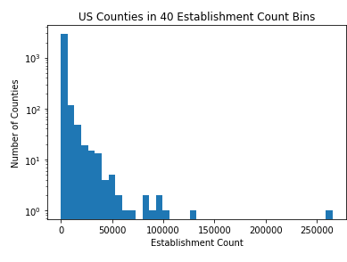

# Exploratory Data Analysis
[Notebook](https://github.com/raymondgh/springboard-data-science/blob/master/Capstone%201/ExploratoryDataAnalysis.ipynb)

## Objective

Visualizing the data enables insights beyond the summary statistics available with simple methods like .info() and .describe(). In the Exploratory Data Analysis notebook, I visualize a few attributes of interest across counties and time. It should be noted that the time-based analysis should not be treated with the same level of scrutiny as the snapshot views, as the data is _not_ time series data; there is no guarantee as too how many migrants originate and destine for a county within the year, nor how many businesses are started and closed down within the year. Only the totals are made available.

This brief exploration serves best as an overview of the data to be modeled. While a few conclusions can be drawn from the visualizations, nearly each pattern warrants additional exploration. For this summary-level analysis, exploration is kept broad and thin.

## Importing the Data

The data is imported as needed from the data/interim directory. All data has been keyed to geo_id, the unique US County and county equivalent identifier. Data is available for the years of 2005 through 2015. Analysis is done on the canonical 3,142 US counties represented in the Business Establishments and Employees files, not the divergent county lists in the population files.

## Analyzing it

The county data is overviewed for the most recent year of 2015 and for identified periods of interest representing the financial recession from 2007 through 2011 and subsequent recovery from 2011 through 2015. Visualizations are categorized into business focus, migration focus, and relationship focus.

### Business

Business data includes total number of establishments and employees for each US county for the years 2005 through 2015.

#### Snapshot 2015

#### Country-wide trends

#### Trends within periods

### Migration

Migration data includes totals for inflow and outflow for each county regarding each county in the dimensions of tax returns (representing a household), tax exemptions (approximating number of people), and adjusted gross income (not visualized) for the years 2005 through 2015.

#### Country-wide trends

#### County-local trends

#### Overall

### Business and Migration

Correlative analysis is kept simple for the data exploration and focus on the summary level data of total establishments and migrations.

#### Snapshot 2015

#### Periods

#### Hide some outliers

## Reflection

Whoa that was neat. how neat was that?
