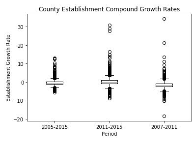
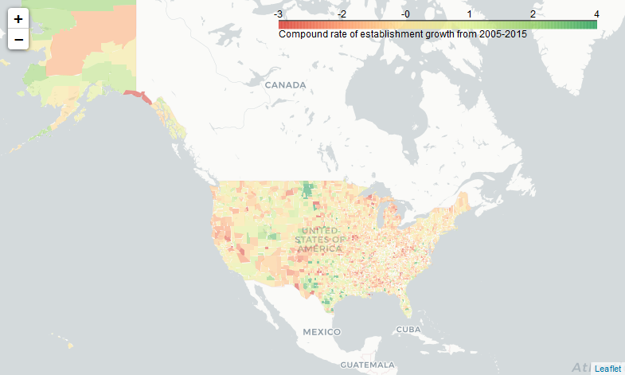
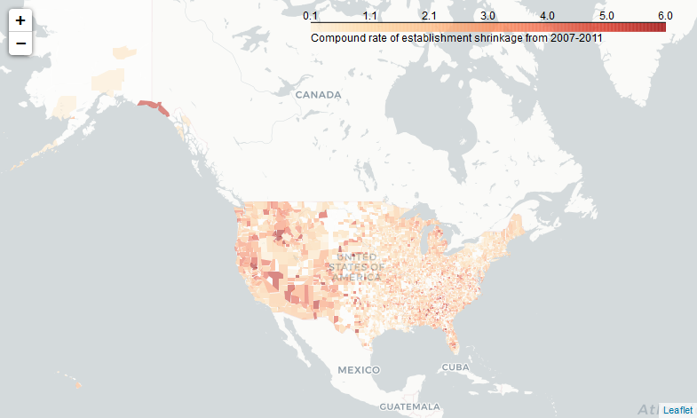
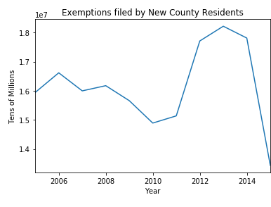
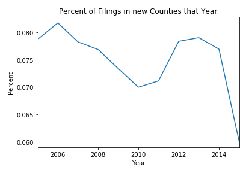
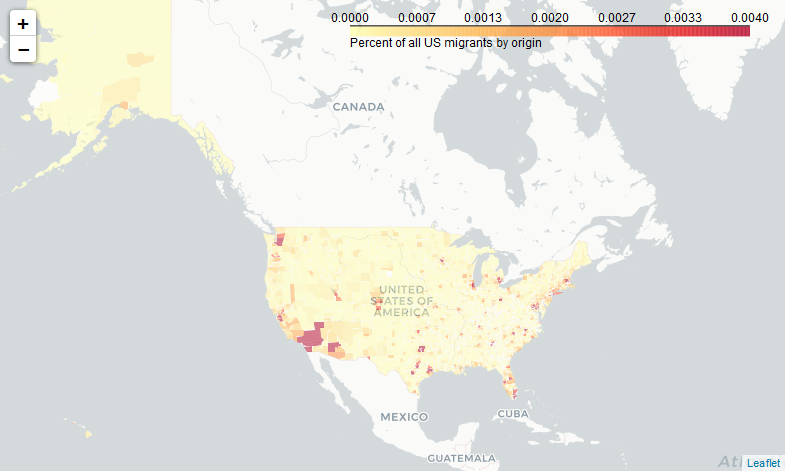
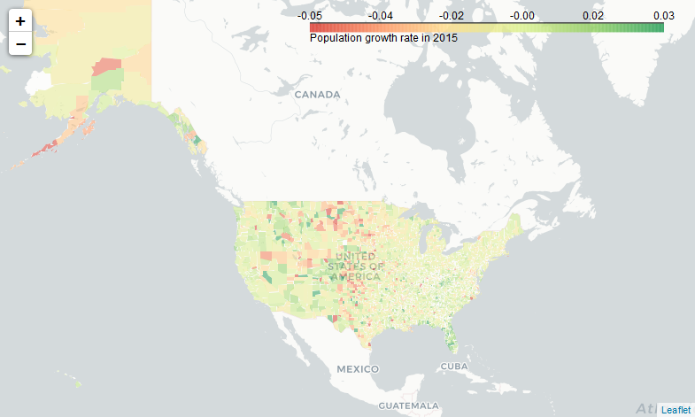
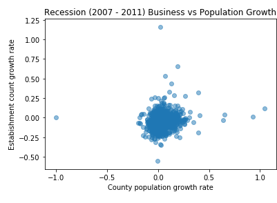
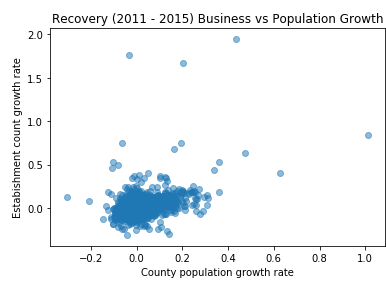

# Predicting County Business Growth
Ray Harris

March 4, 2018

## Outline

- [Introduction](#introduction)
- [Data Acquisition and Cleaning](#data-acquisition-and-cleaning)
- [Data Exploration](#data-exploration)
- [Descriptive Statistics](#descriptive-statistics)
- [Modeling](#modeling)
- Using Model and Recommendations
- Assumptions and Limitations
- Other Data and Future Work
- Conclusion

## Introduction

[Capstone Proposal](Proposal.md)

How much will a given local economy in the US grow or shrink this year? Since the great recession, awareness of economic trends has reached an all-time high. Corporations, governments, and families strive to make more economical investments. Given the complex range of factors contributing to a town or geography's economic growth and momentum, is it possible to predict the net growth or shrinkage of employer establishments in a county? Using historical US county-to-county population migration and historical business establishment data, this study aims to build a model for predicting the change in number of employer establishments in a given US county.

The historical data on business growth comes from the [County Business Patterns](https://www.census.gov/data/tables/2015/econ/cbp/us-states-counties-pr-island-areas.html) report from the United States Census. This includes the number of establishments by sector in all counties from 2005 through 2015 as well as payroll information and number of paid employees. The historical data on taxpayer migration comes from the [U.S. Population Migration Data](https://www.irs.gov/statistics/soi-tax-stats-migration-data) from the United States Internal Revenue Service which comes in two formats: an older style of a zip of XLS files for 1990 through 2011, and a newer style of CSVs from 2011 through 2016. The migration data includes total inflow and outflow of tax filers by year.

## Data Acquisition and Cleaning

[Notebook](Data%20Wrangling.ipynb)
 
To answer the study's core questions about the relationship between US migration and business growth, observations of counties and their attributes of business status, immigration, and emigration are needed for each year between 2005 and 2015. 

[County Business Patterns data](https://www.census.gov/data/tables/2015/econ/cbp/us-states-counties-pr-island-areas.html) was acquired by downloading 11 CSV files from the census website, selecting all optional columns to be included. Each was read into a dataframe and columns renamed to remove punctuation. 

[U.S. Population Migration Data](https://www.irs.gov/statistics/soi-tax-stats-migration-data) was aquired by downloading 4 CSV files and 7 ZIP files including 102 XLS files each. These files were further segmented into three different data formats for parsing, and four different filename formats for gathering for batch processing. Unlike the County Business Patterns data, the only year-identifying information in the migration data was found in the filenames. To add this information to the dataframes, dictionaries of years and lists of files were created and iterated over as tuples using the .items() method.

Missing values were initially identified by comparing the resulting dataframe shapes and uniques before concatenating them, typically by year. To determine how to handle changes in county districting from 2005 to 2015, the [US Census Bureau](https://www.census.gov/geo/reference/county-changes.html) was consulted. Based on this information, some counties had missing values filled with 0s and some were backfilled. The census bureau also witholds employee count information when values are low enough to reveal personally identifiable information (less than 10); these missing values were converted to 0s.

Some unidentified county GeoIDs were also discovered by visually examining the data. There is no state with a FIPS code of 97 (most are between 1 and 50). Exploration of the data [documentation](https://www.irs.gov/pub/irs-soi/1415inpublicmigdoc.pdf) indicates that summary data is included inline and formatted with unused GeoIDs. These were filtered out accordingly.

The unique identifier was determined to be a "Geo ID" which is a combination of a State FIPS code and a County FIPS code. This information is found on a [Census Help Page](https://www.census.gov/geo/reference/geoidentifiers.html) and [Glossary](https://www.census.gov/programs-surveys/metro-micro/about/glossary.html). While much more information is available including various CBSAs (combined statistical areas) that are grouped by economic exchange, this can ultimately be described as derivative. GeoIDs were also normalized into 5-digit strings (two for state, two for county).

Data was ultimately pivoted into multi-index dataframes, dropping unneeded columns and filling remaining null values with 0. Lastly, data is saved to three CSV files in the "/data/interim/" folder. However, these files are over the GitHub filesize maximum of 100MB and are added to the .gitignore file.

## Data Exploration

[Notebook](Exploratory%20Data%20Analysis.ipynb)

Visualizing the data enables insights beyond the summary statistics available with simple methods like .info() and .describe(). In the Exploratory Data Analysis notebook, a few attributes of interest are visualized across counties and time. It should be noted that the time-based analysis should not be treated with the same level of scrutiny as the snapshot views, as the data is _not_ time series data; there is no guarantee as too how many migrants originate and destine for a county within the year, nor how many businesses are started and closed down within the year. Only the totals are made available.

This brief exploration serves best as an overview of the data to be modeled. While a few conclusions can be drawn from the visualizations, nearly each pattern warrants additional exploration. For this summary-level analysis, exploration is kept broad and thin.

The data is imported as needed from the data/interim directory. All data has been keyed to geo_id, the unique US County and county equivalent identifier. Data is available for the years of 2005 through 2015. Analysis is done on the canonical 3,142 US counties represented in the Business Establishments and Employees files, not the divergent county lists in the population files.

The county data is overviewed for the most recent year of 2015 and for identified periods of interest representing the financial recession from 2007 through 2011 and subsequent recovery from 2011 through 2015. Visualizations are categorized into business focus, migration focus, and relationship focus. Matplotlib and Folium Python packages were used to create visualizations.

Business data includes total number of establishments and employees for each US county for the years 2005 through 2015.

Data for the year 2015 represents the most recent available and relevant data to present the current state of affairs. Looking at establishment count only shows a predictable pattern of urbanization that concentrates the majority of business establishments in a a minority of US Counties

To show the extreme nature of the disparity between urban and rural business development, a box plot shows that the middle two quartiles are both hardly above 0 businesses. Most counties are economically small.

A log-based histogram better visualizes the spread. Los Angeles County skews the data tremendously, but the takeaway remains that counties with few establishments are an order of magnitude more common than those with more. Counties vary in geographical size, but they are not balanced by economic activity.

Looking at the same summary data of totals across industry, but combining counties to view by year, a line chart shows that the economic recession and financial collapse had measurable effects on local economies in the US. A net decrease of 361,682 business establishments across the country from 2007 to 2011 is preceded by a decrease in employment of 9,560,937 reported employees from 2006 to 2010. The subsequent increase in number of establishments is also preceded by an increase in employment. 

The economic recession from 2007 through 2011 displaced entrepreneurs and labor who reorganized in the recovery. The bar chart below shows industry distribution of establishments before and after. Retail trade decreased in popularity, but maintained its #1 rank. Construction establishments dropped significantly from 3rd most common to 6th. The biggest gains happened in the Professional, Scientific, and Technical Services, Health Care, and Accomodation & Food Services.

Normalizing change in establishment counts by county gives the opportunity to measure growth rates as percentages. The box plot below shows the distribution of compound growth rates during periods of interest. In the recession, the fastest growing counties were found in Texas, North Dakota, South Dakota, Nevada, Nebraska, Alaska, Wisconson and Missouri. During the recovery, Texas dominates the outlier list, while Florida counties are most found in the third quartile. The biggest drops in the recession happened in Georgia, Nebraska, Oklahoma, and Utah. The biggest drops in the recovery happened in Missouri, Montana, Nevada and South Dakota.

Visualizing 2005-2015 with compound growth rates.

Visualizing 2007-2011 with compound shrinkage rates.

Visualizing 2011-2015 with compound growth rates.

Migration data includes totals for inflow and outflow for each county regarding each county in the dimensions of tax returns (representing a household), tax exemptions (approximating number of people), and adjusted gross income (not visualized) for the years 2005 through 2015.

As a baseline to understand population in the US, tax exemptions filed can approximate number of people. However, tax filing is only required of those who generate income and are required to report to the IRS. A clear drop in number of exemptions filed breaks from a pattern of growth during the window of 2009-2013. This is likely a result of the economic downturn and resulting decrease in employment. The exemptions filed dip, however, occurs later than both the dip in number of establishments and number of reported employees. The line chart below shows total exemptions filed by year.

Examining only exemptions filed by residents new to their filing counties tells a different story. A decrease in this line shows both a decrease in overall filings as well as a decrease in mobility.

Plotting the line of exemptions by migrant filers as a percent of total exemptions filed tells a different story. From this third line chart, it can be seen that fewer people moved during the recession, yet that an even greater decrease in mobility can be observed in 2015.

Maps below explore the migration trends in the 2014-2015 filing years. The first shows each county colored by the percentage of residents that were new to the county in the year 2015. Despite vocal New Yorkers' complaints that too many people from Ohio move to the big apple, it can be seen that the midwest and southeast hold the counties most immigrated to from outside as a percentage of total people.. 

The same metrics are reproduced below with coloring based on migration origin rather than destination. The distribution is less polarized than the destination map, indicating that people moved to areas of interest in 2015 and leaving from all over. Many of the same areas exhibit the highest values, indicating high overall churn.

Normalizing by share of total migrants produces a less visually interesting display. Most people move to big cities.

By the same logic, it can be explained that most people are moving from big cities as well.

In summary, we can see that not all counties are growing in population. The map below indicates blue counties as exhibiting population growth and purple as shrinkage. The patterns here may indicate that many migrants are moving within state, as nearly every state has counties that both grew and shrank.

Population growth rate in 2015 is normalized by county in the map below. Florida must be atracting migrants from out of state, while a vertical stripe of migration in the west indicates significant reorganization, perhaps further west to the edge of Pacific and Mountain timezones.

Correlative analysis is kept simple for the data exploration and focus on the summary level data of total establishments and migrations.

Exploring 2015 data on its own shows short term correlative data. The patterns are unexpectedly unpronounced, but there are many possible explanations. One hypothesis is that a migrant will settle in to a new community for more than a year before starting or helping to start a new business.

The first scatter plot shows how the rate of establishment growth relates to the ratio of residents who are new.

The second scatter plot shows how the net establishment increase relates to the total immigrant count.

The third scatter plot shows how the net population change relates to the net establishment increase

Looking at the data over longer periods of time indicates stronger relationships between migration and business growth. In the scatter plots below, population growth rate is compared to establishment count growth rate in the periods of Recession and Recovery respectively.

The smallest and largest counties can experience nominal growth that registers as high rates of growth or extreme growth that doesn't relate to the scale of the bulk of the data. The following two scatter plots show the business establishment growth rates against the local population growth rates in periods of interest for the middle 80th percentile of counties by population size in 2014.

## Descriptive Statistics

[Notebook](Inferential%20Statistics.ipynb)

Distributions of county populations and retail establishment counts are provided for context, showing exagerrated exponential distributions. Following which, a regression plot confirms that the data are linearly correlated. To answer the study's main question, growth statistics are calculated as the difference between number of establishments and county populations for two consecutive years. This relationship is explored across all 10 years, and across pairs of years. The Pearson Correlation Coefficient is selected to measure the correlation between the values, showing that nearly all years have significant correlations. Finally, county immigration is compared to emigration to confirm that a county's base population is the key determining factor in predicting volume of tax-payer flow. Outliers of residual calculations are highlighted as well.

Unexpectedly, the correlation across all 10 years of change was found only to be -0.02 between population change and retail establishment change. Examining by year revealed the phenomenon of every year displaying a positive correlation except for 2008 and 2009, which showed strong negative correlations. An interpretation would be that when the economy is growing, more people means more business establishments, and that when the economy is in recession, more people means fewer business establishments. This raises the question of whether people are attracted to economies or economies are generated by people. Perhaps migrants are making their decisions to move with incomplete or substandard information during economic recession. 

Looking deeper at the relationship between county immigration and emigration, it can be seen that the bigger the county, the more the churn. While that's true, a handful of outliers were identified, representing counties with the greatest "unexpected" population growth and shrinkage. Interestingly, Los Angeles County, previously seen as the US's largest county by headcount, is also the most unexpectedly deserted county for a number of years. The areas of New Orleans and Chicago also suffered major losses, Chicago's Cook County being the US's second largest county by headcount. On the positive side, the areas of Riverside CA, Phoenix AZ (of US's fourth largest county, Maricopa, AZ), and Austin, TX (Of Travis County, TX) experienced the greatest unexpected growth.

## Sample Preparation

To prepare the canonical data for modeling, interim data is concatenated and simplified into a single CSV file.

A target variable is created as the boolean comparison of a year's business establishment count to the previous year's count. The inflow and outflow data from the IRS is combined with the business data frame with the growth target variable for a completed data set. In the migration data, per-county immigration is simplified from 3,142 counties to in-state and out-of-state to counter the irrelevance of in-state data to each of the other 49 states. In other words, since each state is likely to be most affected by in-state migration, and data from another state is likely only to severely affect its own state, migration data is normalized to in and out of state. Without this modification, more populous states and states with greater volumes of migration would outweigh counties in smaller, less populous states across the entire nation, despite those smaller counties informative value to their immediate neighbors.

The csv file is saved with ten years of samples for 3,142 counties with 1 target variable and 17 explanatory variables.

## Modeling

