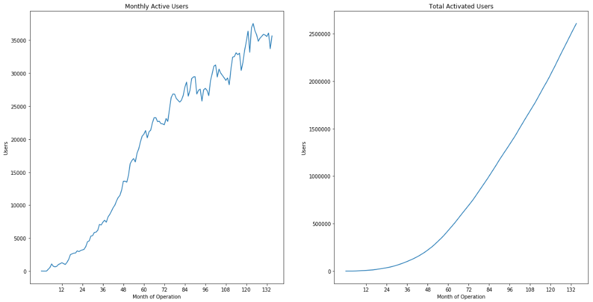
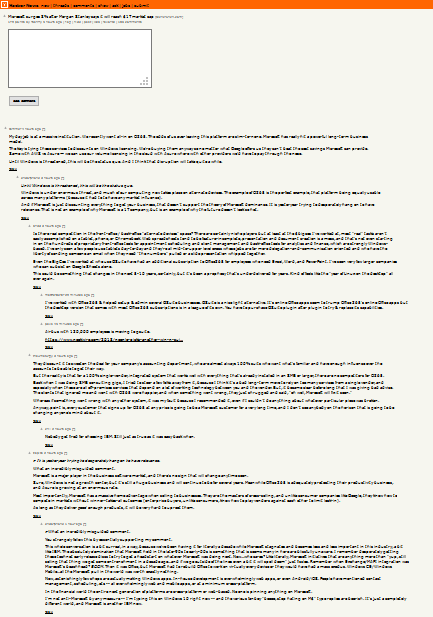
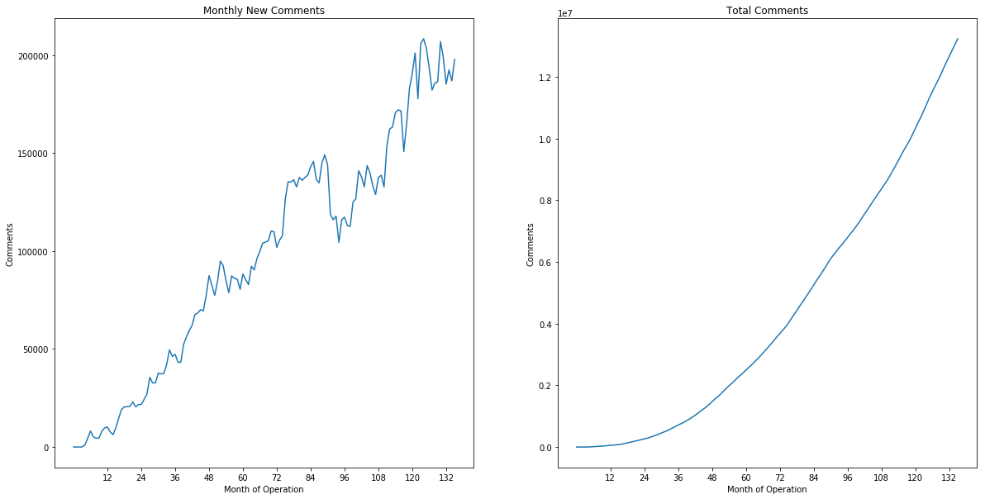

# Exploratory Data Analysis
[Notebook](Exploratory%20Data%20Analysis.ipynb)

## Objective

To gain familiarity with the dataset beyond the typical user experience of visiting the live Hacker News (often stylized as hackernews or hn) website, every item of content from the launch of the forum in 2006 through March 18, 2018 is collected and analyzed. The architecture of hackernews focuses on stories and comments as first-class objects that are created by users. There is no concept of user-user connections or networking involved, which is somewhat ironic, given that hackernews could be considered an important social hub for technophiles. 

This exploration introduces the dataset and dives into the concept of topic identification with the visualization of buzzword popularity over time.

## Importing the Data

Interim data is loaded after the processing done with the original BigQuery Data. At this point, the data has been pulled from the HackerNews API, uploaded to Google BigQuery, exported to Google Cloud Storage, split into 17 CSV files and downloaded locally, and processed with few changes needed along the way. For more, check out this project's wrangling step.

## Analyzing it

The dataset includes content from the 13 years from 2006 through 2018, but since the first and last year only have a few months of data, their content will be excluded from annual summaries, and most examination of the data is done on a monthly basis. Standard libraries of numpy and pandas are used along with matplotlib.pyplot for visualizations. TfidVectorizer is imported from scikit-learn to weigh descriptiveness of words. From Scipy, interpolate is used to improve legibility of trend plots. Html2text is used to parse the text bodies and drop html content, while WordCloud is used for a simple visualization.

### Summary Analysis

YCombinator was founded in March 2005 and the news forum was launched just over a year later. This has made a lot of people very happy and been widely regarded as a good move. Defining an "active user" as a user who posts a comment or story in a given month, these first two plots show monthly active users and cumulative activated users respectively.

On first loading the HackerNews homepage, visitors are presented with a list ranking the current top 30 stories on the site. The fomula for this ranking is proprietary, but some of the basic information exposed through the api includes total points and authors / submitter. These two plots show monthly new submissions and cumulative submissions to the site.

At first glance, HackerNews is a place to share links to interesting articles. 

This is true, though it is also true that much educated discussion occurs regarding these articles.

Given this structure, it would be natural to expect some users to comment more than others, and some to share more articles than others. Patterns of engagement could probably be broken into a variety of user segments. In this exploration, there is no re-creation of user content history, so that analysis won't be included, though it is possible to reverse engineer. In the plots below, monthly comments and cumulative comments across the site are shown.

Now, visualizing all three of these over time, we can see cumulative comments in blue, stories in orange, and users in green. It seems that the number of stories relates linearly with the number of active users, while the number of comments has an exponential relationship with the other two.

The same cumulative information is shown again, with a unique axis for each plot. From this chart, we can see how the rates of growth have changed over time, with similar curves indicating a tight coupling. This indicates that the forum has yet to experience uncontrollable issues with growth or spam. For some background on that topic, [Eternal September](https://en.wikipedia.org/wiki/Eternal_September) would help paint the picture.

With each of the three main items summarized, more complex graphics are intuitively understandable. The figure below has a greater information density, so a deeper analysis is warranted. It should be noted that in this figure, the first four months of operation are excluded due to the apparent situation of the forum being privately accessible. It seems that a number of interesting stories were seeded in the first month, a few people tested the site over the next three months, and the platform was opened to the public in the fifth month, October 2006.

In the early months, the network effects of snowballing value were still unproven. In the first 12 months, it makes sense that there's a very high number of stories and comments per user because only the early-adopters are involved at this stage. Fewer comments per story fits this narrative as well. 

In the first four years of growth, these extremes are mitigated as more users actively contribute to discussion threads. Between four and five years after the initial launch, the US economy (YCombinator is based in California) reaches an economic low point as measured by number of business establishments and employees ([see my other project for more details](https://github.com/raymondgh/springboard-data-science/blob/master/Capstone%201/Report.md#data-exploration). This is the best known explanation of the severe dip in engagement by user and per story, as YC had never made a major business model pivot or organizational change until 2014 when a new president was appointed. 

Growth in discussion has recovered and on a per-story basis, surpassed previous maxima. Activity per user could perhaps be an indicator of how welcome a user feels to join the discussion or how deep back-and-forth conversations can go before ending or being taken offline. The only trend that continues across the entire history is the decrease in stories per active user, indicating that Hacker News has definitively shifted in perception from a communal place of sharing to a 1-way news outlet where people can go to read interesting news.

The ratios discussed above are shown again as measured by the cumulative counts rather than the monthly counts. This view depicts trends of stablization and change and corroborate the idea that the first years of the site's operation were dominated by a sharing mentality, while the recent years are dominated by a consumption mentality. However, these are all measured against total activated users, which does include users who are no longer active. Naturally, the stories per user and comments per user would be expected to decrease, though comments per user has such strong growth that it defies this expectation.

### Top Stories

Every day, rankings are used to show 30 threads at a time to site visitors. Among the factors contributing to the ranking formula is the story score, measured in user upvotes. Unlike rank, upvotes don't decay over time, and are preserved and exposed through the API. The jupyter notebook shows the top three high scoring stories for each year, while below a throwback to the most upvoted stories from 2007 and 2008 are shown.

To further analyze the most upvoted topics on hackernews, this exploration considers the top five stories from each year and finds the most descriptive words for each. Unfortunately, the dataset, while it does include a column for number of descendants, only provides the value for stories, not comments. Furthermore, there are no references to children. Only a parent id and an item id are provided. In order to reconstruct the full text document of a story discussion thread, items are recursively traversed until there are no more items matching any of the collected parents. 

After constructing dataframes with all of the children and parent nodes of a given thread, the text values need to be cleaned of HTML elements which have been included in the dataset. The Html2text library is used to extract plaintext. After this step, a corpus of documents is created from the full texts of each thread. 

A TF-IDF feature matrix is constructed using sklearn's TfidfVectorizer function. The resulting descriptive words from these documents are thrown into a word cloud generator, included below. Unexpectedly, in a community dedicated to startups and technology, the number one most descriptive term is "people"! The rest of the terms fit my expectations readily. How do they suit yours?

#### Topic Trends

Now that the concept of topics have been introduced, we'd like to get an overview of the popularity of some topics over time on hackernews. An analyst organization, [Gartner](https://www.gartner.com/smarterwithgartner/top-trends-in-the-gartner-hype-cycle-for-emerging-technologies-2017/), publishes an annual prospectus on emerging technology trends, including an infamous "hype cycle" chart, that predicts the intrinsic value of a given technology as it relates to the amount of attention in the media, or hype, it receives. The 2017 chart is included below. For example, it suggests that "Deep Learning" and "Machine Learning" have just passed their peak hype periods and will continue to decrease in fashionability and "sexiness" for 2-5 years until their utility stabilizes in practical use. Another example point on the plot is "Quantum Computing" which is predicted to increase in hype in the near future until reaching the trough of disillusionment a few years later.

In the images folder of this project, references to the Gartner Hype Cycle charts from 2006 through 2017 are included. For each year, a few of the most hyped topics are selected for analysis on hackernews. In the following chart, each buzzword is counted in frequency as total appearances in a month divided by total comments in that month. For example, "Web 2.0" was mentioned in 0.6% of all comments in one of the early months, while "cloud" and "iot" have continued to dominate at a higher level than most other trends. 

To better evaluate the rise and fall of individual trends, individual plots are constructed that depict monthly frequency of term use over the 11 years of hackernews's operation. The first four months of private site access are excluded as before. Additionally, a red smoothed line is created by interpolation with the SciPy package. Some fun observations include the short-lived attention of "nfc" and "wearable" in the hackernews community. It can also be seen that blockcahin discussion roughly follows the market capitalization of bitcoin. Some trends rise and fall, some plateau, and some terms are so uncommon that the evaluation metric is not relevant. "3d tv," "internet tv," and "byod" (bring your own device) may have been major topics for Gartner, but the data shown here indicates the hackernews community never cared quites so much.

## Reflection

Woo! That's pretty fun. I wish the data were in a slightly better format, but this does well enough. It would be fascinating to cluster all threads by topic and form graph edges between topics, but processing this dataset was already overwhelming for my quad-core PC. This shouldn't be a problem for the main goal of the project, but it does give room to continue beyond the scope of this EDA. Parallelization with Spark/Hadoop would be feasible to munge data, but IO would still be a significant cost. In the next phase, I'll look at directly addressing the original proposal's questions about content recommendation.
