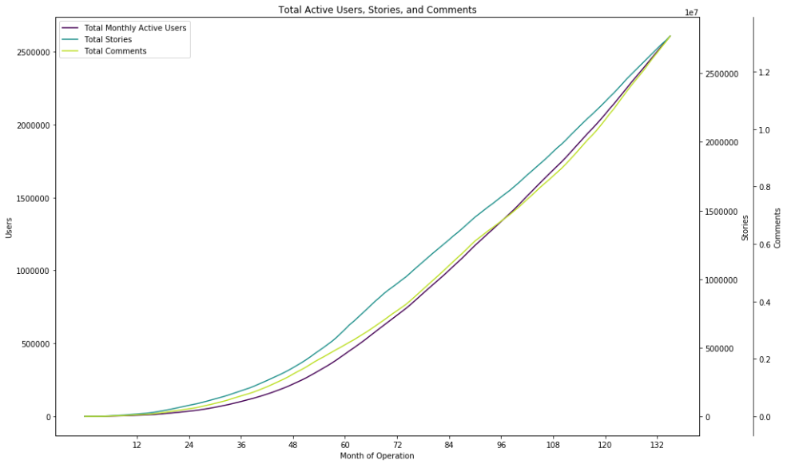
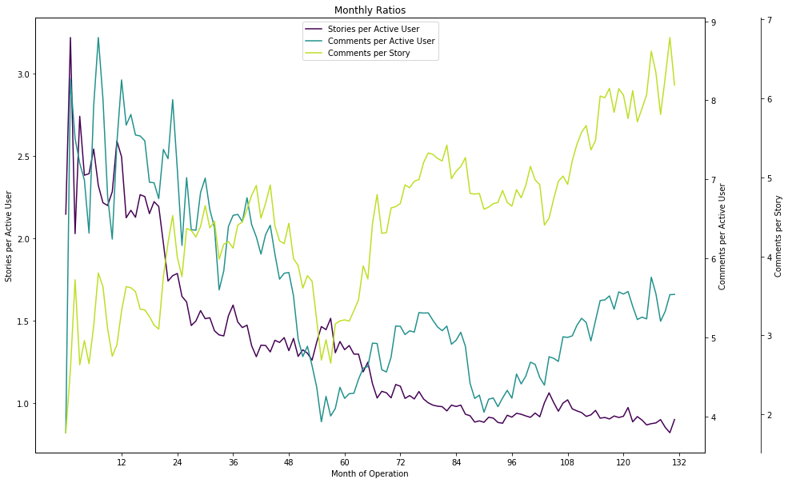
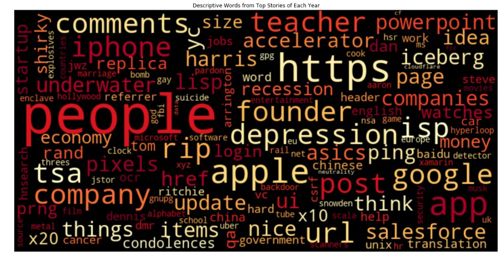
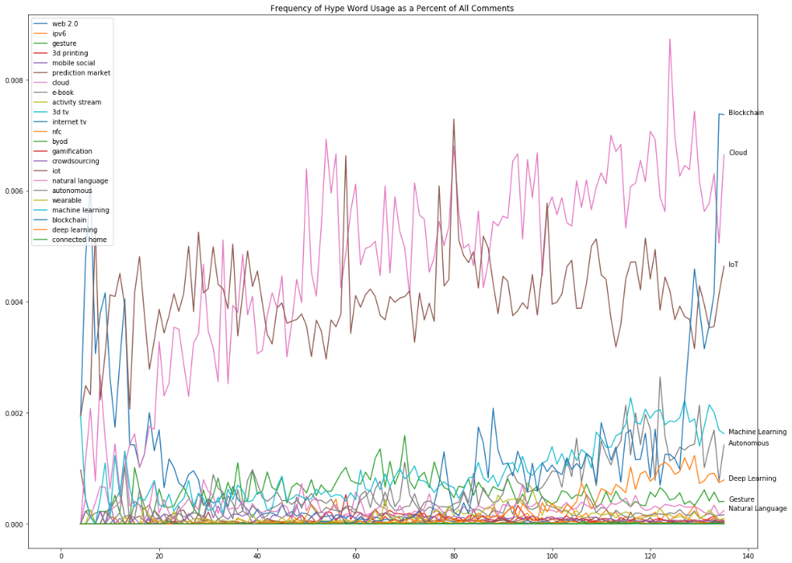

# Exploratory Data Analysis
[Notebook](Exploratory%20Data%20Analysis.ipynb)

## Objective

## Importing the Data

## Analyzing it

### Summary Analysis

### Top Stories

#### Topic Trends

[Gartner](https://www.gartner.com/smarterwithgartner/top-trends-in-the-gartner-hype-cycle-for-emerging-technologies-2017/)

## Reflection
