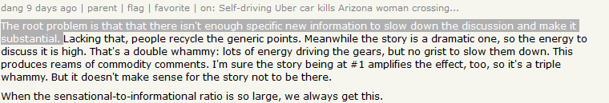

# Modeling

[Notebook](Modeling.ipynb)

## Objective

Breaking down the original objective of recommending content into multiple parts, the modeling notebook aims to identify topics, users, and content.

## Methodology

The full dataset of Hacker News items from launch through March 18th, 2018 is loaded into memory. A few of the same functions used in the exploratory data analysis step are imported to construct documents by looping over node relationships. One additional function is added to call the live Hacker News API to produce links to the latest content submitted by a given user.

First, a subsample of documents is produced. To alleviate the computational burdern of constructing 2.8 million stories, nine stories are manually identified using the Algolia search functionality on the live website. The top three results for the topics of "sexism," "self driving," and "augmented reality" are noted by their IDs and grouped into lists. From each story ID, a document is created consisting of the full text of all of the comments nested under the story. These documents are listed together as a single corpus, representing a miniature Hacker News.

With the nine-document corpus as a proxy for all of Hacker News, a Term Frequency - Inverse Document Frequency method provided by Scikit-Learn is used to identify the most descriptive words for each document. The words are printed as shown below:

The TF-IDF Vectorizer is extremely successful. The first three documents clearly relate to gender issues, the following three reference known autonomous driving companies Uber, Waymo, Google, and the topic of driving, and the final three documents all rank the abbreviation "ar," short for augmented reality, as a top term.

For this project, we will not classify the entire hackernews corpus, but merely present the capability to do so. To scale up to processing 6GB of text data, batched work on dedicated data processing servers would be employed.

In the next step, provocative users are identified for each topic. A user is considered provocative if their comment generates a comment from another user (or themselves). To rank users by this metric, we look at the average number of comments generated per user comment for users with at least 3 comments in the topic. This formula is primitive, but it balances against spammers and one-hit-wonder anomolies. Each comment does have a score, but these scores are not exposed through the web or programmatic interfaces of hackernews; they are only accessible to the owners of the comments.

## Example: Blockchain

As seen in the exploratory data analysis, blockchain is one of the fastest growing "hype" words on hackernews. Given this trend, it is reasonable to use blockchain as an example topic of interest. To begin, a set of documents for the blockchain topic are created. 

Unlike in the original topic identification, these threads are selected from the first few pages of Algolia search results for the term "blockchain." The reason is computational practicality, but there's no theoretical reason that blockchain related threads couldn't be identified with the TF-IDF Vectorizer. In fact, clustering by descriptive words would be more successful, as it strong graph edges would be drawn between similar topics like Bitcoin and Coinbase. 

From this blockchain corpus, top provocateurs are identified using the same formula as above. For the articles selected, the most provocative commenters are victor106, lumberjack, davesque, programmarchy, and joshfraser. As of the writing of this report, their mean "karma," or total upvotes on hackernews, is 3,235.6 points. For reference, I personally have contributed stories and comments that have earned 145 points; Sam Altman, the president of YCombinator has 21,344 points; and the average number of points generated by a story on the front page is 175 points. To help digest that, remember that of the 2.88 million stories shared so far, only 2.5% have earned more than 100 points. In summary, these users can safely be considered established members of the community.

Finally, with the provocative users identified, a function calls the live Hacker News API and returns the five threads most recently participated in by these individuals. From here, the practical application requires again the documentation of the full hackernews corpus. With a fully categorized corpus, users could browse a topic like "blockchain" to discover provocative users to "follow." Furthermore, filters could be put in place to only serve new content to the user if the activities by the followed users are within documents categorized as blockchain. 

## Conclusion

TF-IDF Vectorizer is proven to be a relevant formula for identifying categories/topics/tags for hackernews articles. Content recommended by the algorithm developed here does not overlap with the content found on the front page, proving further that valuable discussion can be located without constraining one's self to the landing page of Hacker News where most of the attention is paced.

As HN moderator Daniel Gackle comments specifically on the issue of there being too many comments with too little news on front-page articles.

This project proudly takes a step toward investigating a solution whereby commenters can discover interesting content outside of the front page, lessening the issue of "commodity comments.""

## Reflection

Working with a large data set is challenging. However, the purpose of this project is to explore technologies and demonstrate ability to leverage them to achieve practical results. Overall, I'm quite happy with the progress and would be excited to look into some of the larger scale applications of this concept and possibly deployment to a live web-app. 
