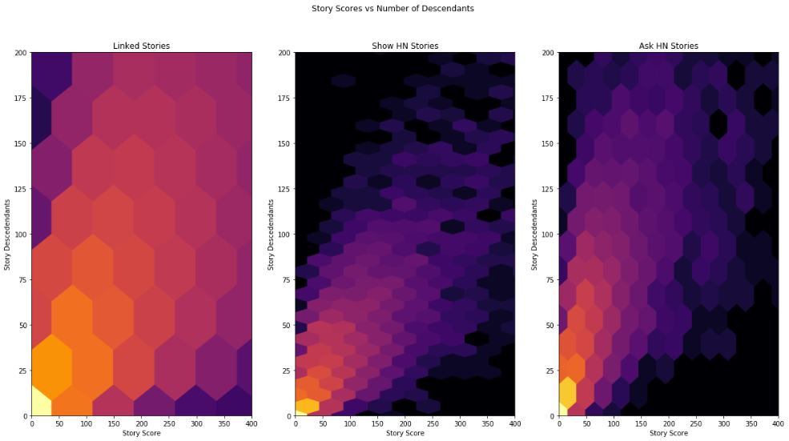
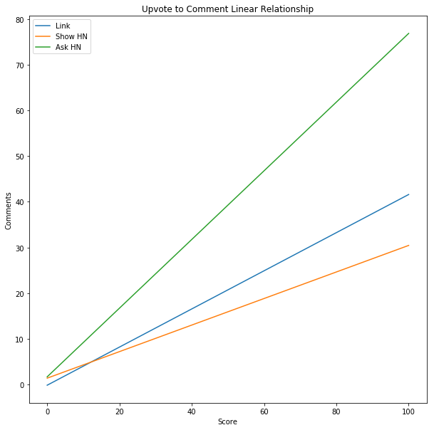

# Recommending Hacker News Content
Ray Harris

March 29, 2018

[PDF](Report%20-%20Recommending%20Hacker%20News%20Content.pdf)

[Slides](https://docs.google.com/presentation/d/1OJ2JILEILx726Q8af-5XOXPtt84IBBUcNhumGbuxJYs)

## Outline

- [Introduction](#introduction)
- [Data Acquisition](#data-acquisition)
- [Data Exploration](#data-exploration)
- [Descriptive Statistics](#descriptive-statistics)
- [Modeling](#modeling)
- [Assumptions and Limitations](#assumptions-and-limitations)
- [Other Data and Future Work](#other-data-and-future-work)
- [Conclusion](#conclusion)

## Introduction

Who should I follow on Hackernews? Unlike popular social media platforms like Facebook and Instagram, Hackernews has no version of a "news feed," or any content customization for that matter. As the hackernews audience continues to grow, front-page content becomes increasingly general and shallow, decreasing the depth of interaction, and ultimately the value created both for users and for the Y Combinator professional network.

Y Combinator may have intentionally ignored the trend of personalized activity feeds, but the creation of a minimum-viable-product could provide actionable insights for the organization, or at least additional confidence in the existing path. Recruiters and advertisers would rejoice at the increased targeting made possible by this reorganization of data, and special-interest groups would benefit from having relevant content promoted to relevant people.

To create a content recommendation engine, a multi-step process is necessary. First, popular submissions and comments will be clustered into topics. Second, influential users will be identified for those topics. In a production enviornment, the findings here could be used to serve targeted content to users based on "followed" users or topics.

## Data Acquisition

The dataset involved in this project is over 6GB in size and grows every single day. To achieve the project objective, the data must be collected and cleaned for programmatic consumption.

The Hacker News corpus is the only data source for this exploration. A Kaggle user has aggregated the data from 2006 through 2017 [Kaggle BigQuery](https://www.kaggle.com/hacker-news/hacker-news) which is accesible freely from Google at their [BigQuery Repository](https://cloud.google.com/bigquery/public-data/hacker-news). Data is exported to a private Google Cloud Storage within the free tier of usage and segmented into 17 CSV files about 350 MB each. Finally, the data is downloaded in Python with the urllib.request library.

The dataset is already well-kept and contains few missing values. The greatest source of errors were missing values caused by content deletion, a power any hackernews user has over their own content. The ID and Parent ID fields are cast to integers for easy comparison, and the text bodies of the comments are parsed to remove HTML elements, as the hackernews API provides comments as html, which is not subsequenty parsed by the user maintaining the Google Big Query data store.

Each row is one observation of a content item on the website: either a story or a comment. The properties for these two types of content are identical, so it is reasonable to keep them in the same dataframes. Furthermore, it's useful to maintain them this way as the only reference between children and parent nodes in nested discussions are in the ID and Parent ID fields.

## Data Exploration

To gain familiarity with the dataset beyond the typical user experience of visiting the live Hacker News (often stylized as hackernews or hn) website, every item of content from the launch of the forum in 2006 through March 18, 2018 is collected and analyzed. The architecture of hackernews focuses on stories and comments as first-class objects that are created by users. There is no concept of user-user connections or networking involved, which is somewhat ironic, given that hackernews could be considered an important social hub for technophiles. 

This exploration introduces the dataset and dives into the concept of topic identification with the visualization of buzzword popularity over time.

### Analyzing it

The dataset includes content from the 13 years from 2006 through 2018, but since the first and last year only have a few months of data, their content will be excluded from annual summaries, and most examination of the data is done on a monthly basis. Standard libraries of numpy and pandas are used along with matplotlib.pyplot for visualizations. TfidVectorizer is imported from scikit-learn to weigh descriptiveness of words. From Scipy, interpolate is used to improve legibility of trend plots. Html2text is used to parse the text bodies and drop html content, while WordCloud is used for a simple visualization.

### Summary Analysis

YCombinator was founded in March 2005 and the news forum was launched just over a year later. This has made a lot of people very happy and been widely regarded as a good move. Defining an "active user" as a user who posts a comment or story in a given month, these first two plots show monthly active users and cumulative activated users respectively.

On first loading the HackerNews homepage, visitors are presented with a list ranking the current top 30 stories on the site. The fomula for this ranking is proprietary, but some of the basic information exposed through the api includes total points and authors / submitter. These two plots show monthly new submissions and cumulative submissions to the site.

At first glance, HackerNews is a place to share links to interesting articles. 

This is true, though it is also true that much educated discussion occurs regarding these articles.

Given this structure, it would be natural to expect some users to comment more than others, and some to share more articles than others. Patterns of engagement could probably be broken into a variety of user segments. In this exploration, there is no re-creation of user content history, so that analysis won't be included, though it is possible to reverse engineer. In the plots below, monthly comments and cumulative comments across the site are shown.

Now, visualizing all three of these over time, we can see cumulative comments in blue, stories in orange, and users in green. It seems that the number of stories relates linearly with the number of active users, while the number of comments has an exponential relationship with the other two.

The same cumulative information is shown again, with a unique axis for each plot. From this chart, we can see how the rates of growth have changed over time, with similar curves indicating a tight coupling. This indicates that the forum has yet to experience uncontrollable issues with growth or spam. For some background on that topic, [Eternal September](https://en.wikipedia.org/wiki/Eternal_September) would help paint the picture.

With each of the three main items summarized, more complex graphics are intuitively understandable. The figure below has a greater information density, so a deeper analysis is warranted. It should be noted that in this figure, the first four months of operation are excluded due to the apparent situation of the forum being privately accessible. It seems that a number of interesting stories were seeded in the first month, a few people tested the site over the next three months, and the platform was opened to the public in the fifth month, October 2006.

In the early months, the network effects of snowballing value were still unproven. In the first 12 months, it makes sense that there's a very high number of stories and comments per user because only the early-adopters are involved at this stage. Fewer comments per story fits this narrative as well. 

In the first four years of growth, these extremes are mitigated as more users actively contribute to discussion threads. Between four and five years after the initial launch, the US economy (YCombinator is based in California) reaches an economic low point as measured by number of business establishments and employees ([see my other project for more details](https://github.com/raymondgh/springboard-data-science/blob/master/Capstone%201/Report.md#data-exploration). This is the best known explanation of the severe dip in engagement by user and per story, as YC had never made a major business model pivot or organizational change until 2014 when a new president was appointed. 

Growth in discussion has recovered and on a per-story basis, surpassed previous maxima. Activity per user could perhaps be an indicator of how welcome a user feels to join the discussion or how deep back-and-forth conversations can go before ending or being taken offline. The only trend that continues across the entire history is the decrease in stories per active user, indicating that Hacker News has definitively shifted in perception from a communal place of sharing to a 1-way news outlet where people can go to read interesting news.

The ratios discussed above are shown again as measured by the cumulative counts rather than the monthly counts. This view depicts trends of stablization and change and corroborate the idea that the first years of the site's operation were dominated by a sharing mentality, while the recent years are dominated by a consumption mentality. However, these are all measured against total activated users, which does include users who are no longer active. Naturally, the stories per user and comments per user would be expected to decrease, though comments per user has such strong growth that it defies this expectation.

### Top Stories

Every day, rankings are used to show 30 threads at a time to site visitors. Among the factors contributing to the ranking formula is the story score, measured in user upvotes. Unlike rank, upvotes don't decay over time, and are preserved and exposed through the API. The jupyter notebook shows the top three high scoring stories for each year, while below a throwback to the most upvoted stories from 2007 and 2008 are shown.

To further analyze the most upvoted topics on hackernews, this exploration considers the top five stories from each year and finds the most descriptive words for each. Unfortunately, the dataset, while it does include a column for number of descendants, only provides the value for stories, not comments. Furthermore, there are no references to children. Only a parent id and an item id are provided. In order to reconstruct the full text document of a story discussion thread, items are recursively traversed until there are no more items matching any of the collected parents. 

After constructing dataframes with all of the children and parent nodes of a given thread, the text values need to be cleaned of HTML elements which have been included in the dataset. The Html2text library is used to extract plaintext. After this step, a corpus of documents is created from the full texts of each thread. 

A TF-IDF feature matrix is constructed using sklearn's TfidfVectorizer function. The resulting descriptive words from these documents are thrown into a word cloud generator, included below. Unexpectedly, in a community dedicated to startups and technology, the number one most descriptive term is "people"! The rest of the terms fit my expectations readily. How do they suit yours?

### Topic Trends

Now that the concept of topics have been introduced, we'd like to get an overview of the popularity of some topics over time on hackernews. An analyst organization, [Gartner](https://www.gartner.com/smarterwithgartner/top-trends-in-the-gartner-hype-cycle-for-emerging-technologies-2017/), publishes an annual prospectus on emerging technology trends, including an infamous "hype cycle" chart, that predicts the intrinsic value of a given technology as it relates to the amount of attention in the media, or hype, it receives. The 2017 chart is included below. For example, it suggests that "Deep Learning" and "Machine Learning" have just passed their peak hype periods and will continue to decrease in fashionability and "sexiness" for 2-5 years until their utility stabilizes in practical use. Another example point on the plot is "Quantum Computing" which is predicted to increase in hype in the near future until reaching the trough of disillusionment a few years later.

In the images folder of this project, references to the Gartner Hype Cycle charts from 2006 through 2017 are included. For each year, a few of the most hyped topics are selected for analysis on hackernews. In the following chart, each buzzword is counted in frequency as total appearances in a month divided by total comments in that month. For example, "Web 2.0" was mentioned in 0.6% of all comments in one of the early months, while "cloud" and "iot" have continued to dominate at a higher level than most other trends. 

To better evaluate the rise and fall of individual trends, individual plots are constructed that depict monthly frequency of term use over the 11 years of hackernews's operation. The first four months of private site access are excluded as before. Additionally, a red smoothed line is created by interpolation with the SciPy package. Some fun observations include the short-lived attention of "nfc" and "wearable" in the hackernews community. It can also be seen that blockcahin discussion roughly follows the market capitalization of bitcoin. Some trends rise and fall, some plateau, and some terms are so uncommon that the evaluation metric is not relevant. "3d tv," "internet tv," and "byod" (bring your own device) may have been major topics for Gartner, but the data shown here indicates the hackernews community never cared quites so much.

## Descriptive Statistics

To dive a bit deeper into the the hackernews data, the relationship between a story's score and its generated discussion is examined. In particular, this study should answer whether upvotes and comments are produced by users at a different rate for three different types of content: links, Ask HN's, and Show HN's.

Distributions of story properties of descendants and scores are shown. Descendants is a measure of how many comments were added by users in association with the story, including comments referencing other comments. Score is a measure of how many upvotes a story received. From two simple distribution plots, it can be seen that the vast majority of stories submitted to hackernews are ignored by most users. There is an exponential distribution whereby most stories have no comments and few have very many, likewise with points.

With 2.8 million entries, rendering a scatterplot is not feasible. Instead, a hexbin is plotted that simplifies the data by binning it into 80 bins along the x axis with a corresponding number of bins (based on the data) to maintain hexagon regularity. 

Strong relationships are seen across all three types of content. The Pearson coefficient measures a positive correlation of 0.82, 0.81, and 0.80 for links, show, and ask type stories. 

It's important to note that the three plots in the figure above are scaled to the same horizontal and vertical axis ranges. However, the hexagons are scaled to encompass the data. Therefore, since the "Linked" story type has greater variety in story score as well as amount of comments, the hexagons are both wider and taller. 

It appears that the relationships are all strong positive correlations, but that there are significant differences in variance. The following plot shows the lines of best fit for each type of story.

The sheer quantity of content posted to hackernews that goes without votes or replies is astounding. When browsing the main website, users will only encounter the top ranked posts under normal circumstances. It has been seen as an achievement to have self-produced content reach the front of hackernews, and the data strongly supports that. On the other hand, much of it could be spam, though it seems unlikely, as spam is not a major issue on the site.

The correlation between replies and upvotes is unsurprisingly strong, though it is noteworthy that the personal threads of "Ask" and "Show" HN threads appear to have less variance by visual inspection. Relationally, "Ask HN" threads generate most comments, "Show HN" threads generate fewest comments, and linked stories generate a wide range of comments per upvote.

## Modeling

Breaking down the original objective of recommending content into multiple parts, the modeling notebook aims to identify topics, users, and content.

The full dataset of Hacker News items from launch through March 18th, 2018 is loaded into memory. A few of the same functions used in the exploratory data analysis step are imported to construct documents by looping over node relationships. One additional function is added to call the live Hacker News API to produce links to the latest content submitted by a given user.

First, a subsample of documents is produced. To alleviate the computational burdern of constructing 2.8 million stories, nine stories are manually identified using the Algolia search functionality on the live website. The top three results for the topics of "sexism," "self driving," and "augmented reality" are noted by their IDs and grouped into lists. From each story ID, a document is created consisting of the full text of all of the comments nested under the story. These documents are listed together as a single corpus, representing a miniature Hacker News.

With the nine-document corpus as a proxy for all of Hacker News, a Term Frequency - Inverse Document Frequency method provided by Scikit-Learn is used to identify the most descriptive words for each document. The words are printed as shown below:

The TF-IDF Vectorizer is extremely successful. The first three documents clearly relate to gender issues, the following three reference known autonomous driving companies Uber, Waymo, Google, and the topic of driving, and the final three documents all rank the abbreviation "ar," short for augmented reality, as a top term.

Using the NetworkX library, a graph is drawn to show the corpus relationships. Each node is a document, and each edge is a matching descriptive word between those documents. Metadata is added to the graph edges describing the strength of the relationship calculated as the product of the descriptiveness of the word for each document in the pair. This means that each node could have multiple links to another node, one for each keyword that matches.

For this project, we will not classify the entire hackernews corpus, but merely present the capability to do so. To scale up to processing 6GB of text data, batched work on dedicated data processing servers would be employed.

In the next step, provocative users are identified for each topic. A user is considered provocative if their comment generates a comment from another user (or themselves). To rank users by this metric, we look at the average number of comments generated per user comment for users with at least 3 comments in the topic. This formula is primitive, but it balances against spammers and one-hit-wonder anomolies. Each comment does have a score, but these scores are not exposed through the web or programmatic interfaces of hackernews; they are only accessible to the owners of the comments.

### Example: Recommending Blockchain Content

As seen in the exploratory data analysis, blockchain is one of the fastest growing "hype" words on hackernews. Given this trend, it is reasonable to use blockchain as an example topic of interest. To begin, a set of documents for the blockchain topic are created. 

Unlike in the original topic identification, these threads are selected from the first few pages of Algolia search results for the term "blockchain." The reason is computational practicality, but there's no theoretical reason that blockchain related threads couldn't be identified with the TF-IDF Vectorizer. In fact, clustering by descriptive words would be more successful, as it strong graph edges would be drawn between similar topics like Bitcoin and Coinbase. 

From this blockchain corpus, top provocateurs are identified using the same formula as above. For the articles selected, the most provocative commenters are victor106, lumberjack, davesque, programmarchy, and joshfraser. As of the writing of this report, their mean "karma," or total upvotes on hackernews, is 3,235.6 points. For reference, I personally have contributed stories and comments that have earned 145 points; Sam Altman, the president of YCombinator has 21,344 points; and the average number of points generated by a story on the front page is 175 points. To help digest that, remember that of the 2.88 million stories shared so far, only 2.5% have earned more than 100 points. In summary, these users can safely be considered established members of the community.

Finally, with the provocative users identified, a function calls the live Hacker News API and returns the five threads most recently participated in by these individuals. From here, the practical application requires again the documentation of the full hackernews corpus. With a fully categorized corpus, users could browse a topic like "blockchain" to discover provocative users to "follow." Furthermore, filters could be put in place to only serve new content to the user if the activities by the followed users are within documents categorized as blockchain. 

### Modeling Summary

TF-IDF Vectorizer is proven to be a relevant formula for identifying categories/topics/tags for hackernews articles. Content recommended by the algorithm developed here does not overlap with the content found on the front page, proving further that valuable discussion can be located without constraining one's self to the landing page of Hacker News where most of the attention is paced.

As HN moderator Daniel Gackle comments specifically on the issue of there being too many comments with too little news on front-page articles.

This project proudly takes a step toward investigating a solution whereby commenters can discover interesting content outside of the front page, lessening the issue of "commodity comments.""

## Assumptions and Limitations

Despite success tagging topics with descriptive words, there are inherent limitations to the design decisions of the project and technical execution. First and foremost, the content ranking algorithm is based entirely on "provocation" as measured by the number of comments directly responding to the item. In many cases, this can be a post that is emotionally provoking rather than thought provoking -- in other words, trolling and/or spam. Moreover, The fomula does not count grandchildren, and thus a comment by a user that begins a deep discussion but backs out of it will not be rewarded. Most importantly, as shown in the comment-to-upvote relationship plots above, users have a much greater propensity to give an upvote to a comment than to add their own comment; an ideal system would be able to consider these upvotes.

Technical limitations affecting this project are primarily based on the nature of a news discussion board. In order to model a user's interaction with the community, a holistic view of their participation is necessary. In this case, that means analyzing a 10+ year history of over 2.88 million threads. Selecting a subset within a window of time would not capture a user's behavior adequately, so in this project, a subet of threads is selected by topic via manual search.

In the deployment of a content recommendation system, it's important to note the costs of topic selection. If the user is only to provide their own account details and have interests suggested based on past activity, onboarding time would be longer than if the user were to manually select friends/influencers/topics that could be pre-existing or pre-computed.

## Other Data and Future Work

As this project merely demonstrates foundational feasibility of a hackernews newsfeed, there is much to do it see it to completion. Topic keywords have been identified in the form of what would be known as "tags" but these documents could be further classified by constructing a graph of document nodes with edges defined by shared tags. Clusters could then be defined programmatically based on the strength and number of these edges. 

To better represent and serve users with relevant news, commentary, and contributions, integration with more data sources could prove valuable. Some examples include Keybase identification verification, Github profile linking, and LinkedIn networking integrations. With these sources, content could be enriched to not only segment HN traffic into special interests, but also to simultaneously increase the practicality of personal interactions by making communication easier for recruiters and contributors.

## Conclusion

It is shown that text-analysis based content categorization and recommendation is possible, though computationally expensive.

In this project, Hacker News data is pulled from online storage and analyzed to recommend content with a more targeted formula than the live Hacker News website employs. Data is acquired via Google Cloud Storage, and minimally adjusted for analysis.

Trends across time and topic are explored using term frequency-inverse document frequency to extract meaningful subjects from thread documents. Growth of the userbase and their activity is explored visually and numerically over the 12 years of site operation. 

Documents are created from the texts of comments and story submissions by users on the site. Within topics, threads are combined to aggregate user activity. A formula is created to surface the most "provocative" users within each topic, and the recent threads featuring these users' comments are provided as recommendations for subject exploration. In this project, Blockchain-related threads from 2017 and 2018 are used to recommend content involving five provocative users.

While the project explores a viable path toward a content recommendation / personalization system, the limitations of scope and access to data compromise the feasibility of a complete production of such a system. 

Most important to the successful implementation of project based on these findings would be the tuning of the content ranking fomula. For this, user research and satisfaction / engagement testing would be recommended. 
