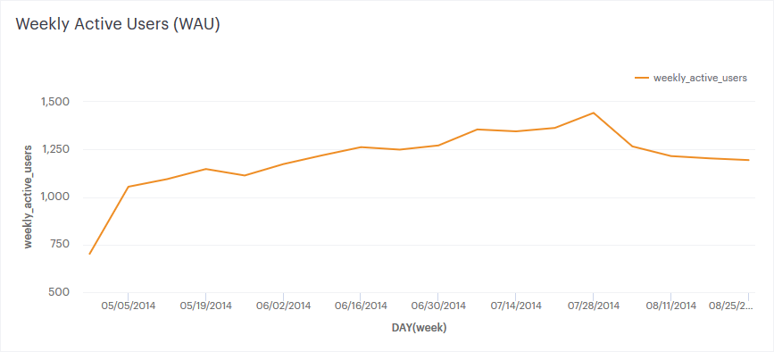
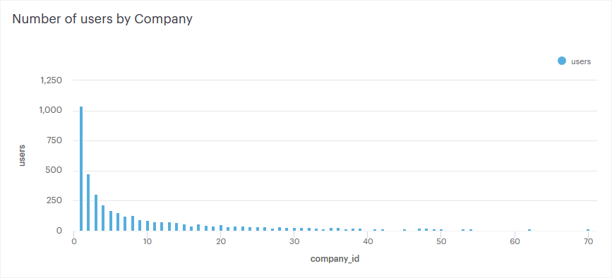
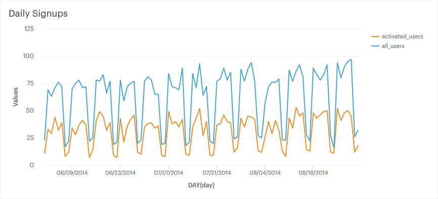
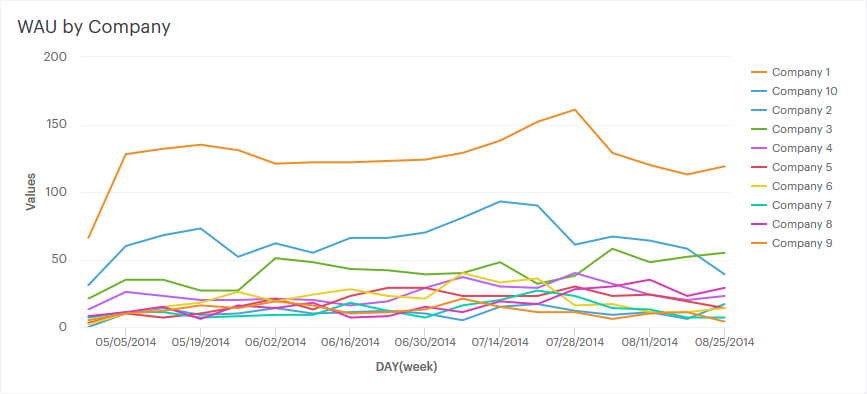
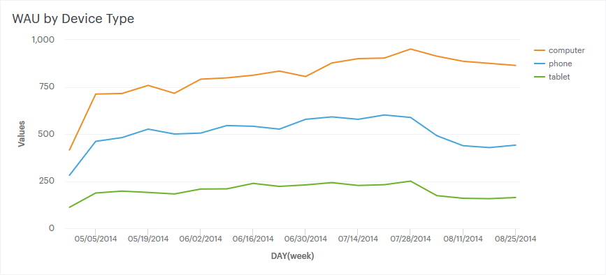
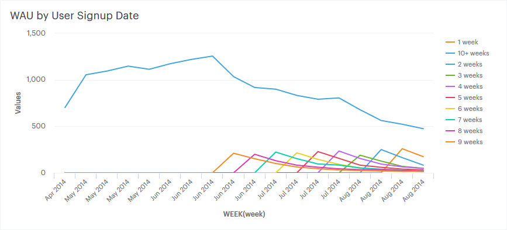

# Case Study: Investigating a Drop in User Engagement
_Note: this data is fake and was generated for the purpose of this case study. It is similar in structure to Yammer’s actual data, but for privacy and security reasons it is not real._
SQL Code for my solution can be seen on [Mode](https://modeanalytics.com/editor/raymondgh/reports/034563872c01)

### The Problem

> You show up to work Tuesday morning, September 2, 2014. The head of the Product team walks over to your desk and asks you what you think about the latest activity on the user engagement dashboards. You fire them up, and something immediately jumps out:

### Hypotheses

We want to know why user engagement has dropped. We'd know already if our servers went down, so a few deeper questions should be asked. Here are some ideas why we might have experienced the drop:

 - A client switched to a competitor along with all their users
 - A new feature was pushed that discourages some segment of users
 - The drop is within normal cyclical activity trends
 - A special promotion or incentive recently ended
 - The service launched on another platform that isn't represented here
 - A large source of traffic dropped in popularity
 - Dropoff was normal but new signups lagged

### Digging In

We are given four tables with a few fields each to analyze the situation. I start be examining some summary information, and continue by drilling down on user engagement to find patterns.

#### What does the distribution of users look like?

#### How many new signups have we had?

#### Are major changes to user engagement localized to one subgroup?

By Company

By Device Type

By Language

By Signup Date

`SELECT DATE_TRUNC('week',z.occurred_at) AS "week",
       COUNT(DISTINCT CASE WHEN z.user_age > 70 THEN z.user_id ELSE NULL END) AS "10+ weeks",
       COUNT(DISTINCT CASE WHEN z.user_age < 70 AND z.user_age >= 63 THEN z.user_id ELSE NULL END) AS "9 weeks",
       COUNT(DISTINCT CASE WHEN z.user_age < 63 AND z.user_age >= 56 THEN z.user_id ELSE NULL END) AS "8 weeks",
       COUNT(DISTINCT CASE WHEN z.user_age < 56 AND z.user_age >= 49 THEN z.user_id ELSE NULL END) AS "7 weeks",
       COUNT(DISTINCT CASE WHEN z.user_age < 49 AND z.user_age >= 42 THEN z.user_id ELSE NULL END) AS "6 weeks",
       COUNT(DISTINCT CASE WHEN z.user_age < 42 AND z.user_age >= 35 THEN z.user_id ELSE NULL END) AS "5 weeks",
       COUNT(DISTINCT CASE WHEN z.user_age < 35 AND z.user_age >= 28 THEN z.user_id ELSE NULL END) AS "4 weeks",
       COUNT(DISTINCT CASE WHEN z.user_age < 28 AND z.user_age >= 21 THEN z.user_id ELSE NULL END) AS "3 weeks",
       COUNT(DISTINCT CASE WHEN z.user_age < 21 AND z.user_age >= 14 THEN z.user_id ELSE NULL END) AS "2 weeks",
       COUNT(DISTINCT CASE WHEN z.user_age < 14 AND z.user_age >= 7 THEN z.user_id ELSE NULL END) AS "1 week",
       COUNT(DISTINCT CASE WHEN z.user_age < 7 THEN z.user_id ELSE NULL END) AS "Less than a week"
  FROM (
        SELECT e.occurred_at,
               u.user_id,
               DATE_TRUNC('week',u.activated_at) AS activation_week,
               EXTRACT('day' FROM e.occurred_at - u.activated_at) AS age_at_event,
               EXTRACT('day' FROM '2014-09-01'::TIMESTAMP - u.activated_at) AS user_age
          FROM tutorial.yammer_users u
          JOIN tutorial.yammer_events e
            ON e.user_id = u.user_id
           AND e.event_type = 'engagement'
           AND e.event_name = 'login'
           AND e.occurred_at >= '2014-05-01'
           AND e.occurred_at < '2014-09-01'
         WHERE u.activated_at IS NOT NULL
       ) z

 GROUP BY "week"
 ORDER BY "week"
LIMIT 100`

#### Have there been any changes to our email strategy or success?

### Recommendation

 - Further questions & how to answer
 - Questions beyond data & how to answer them
 - Most likely cause of engagement dip
 - What the company should do
