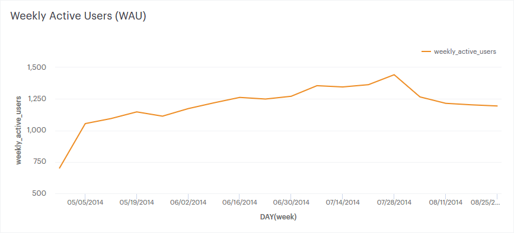
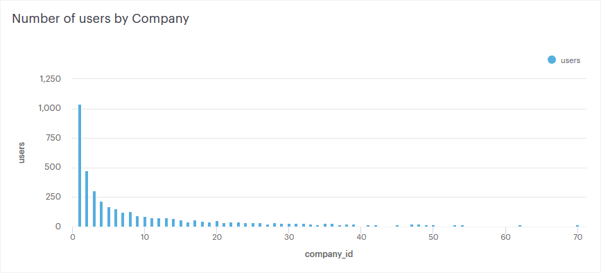
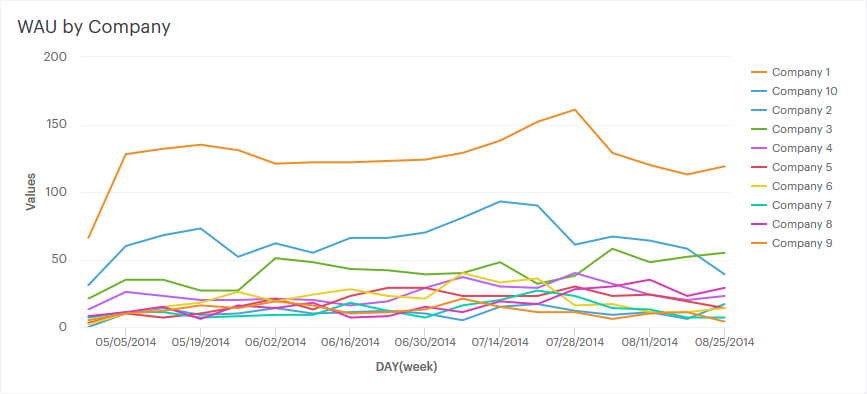
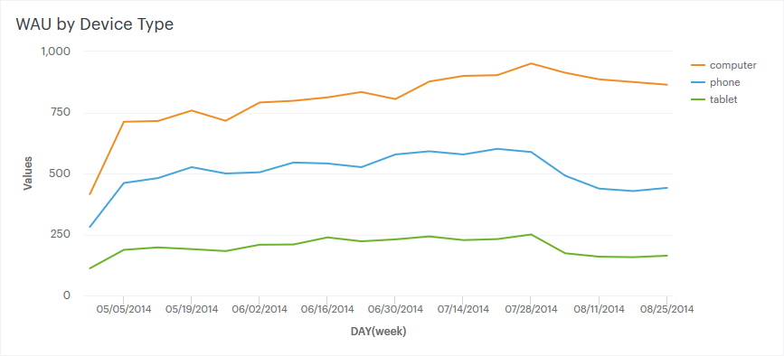
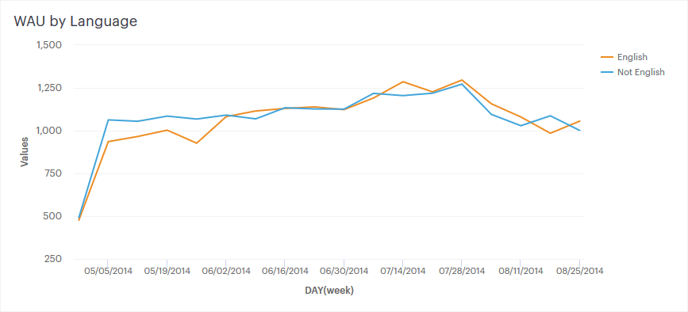
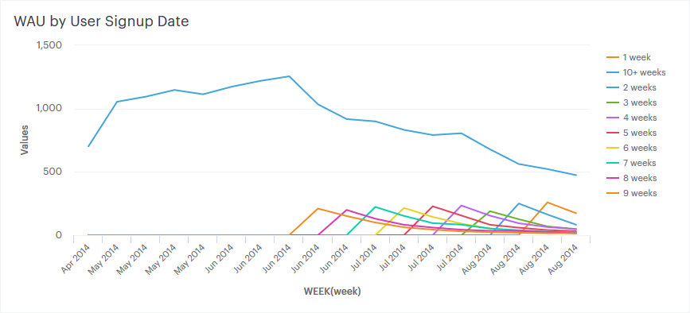
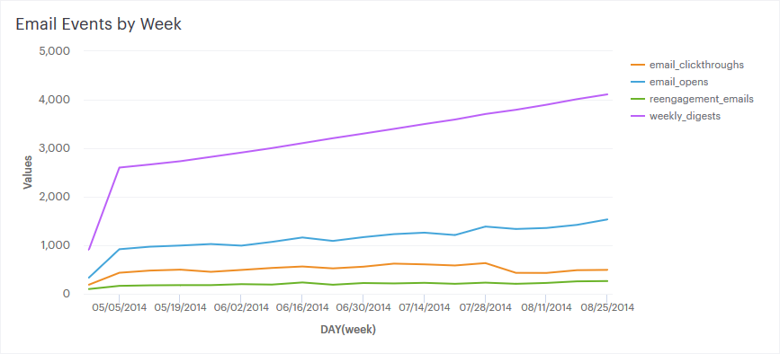

# Case Study: Investigating a Drop in User Engagement
_Note: this data is fake and was generated for the purpose of this case study. It is similar in structure to Yammer’s actual data, but for privacy and security reasons it is not real._

SQL Code for my solution can be seen on [Mode](https://modeanalytics.com/editor/raymondgh/reports/034563872c01)

## The Problem

> You show up to work Tuesday morning, September 2, 2014. The head of the Product team walks over to your desk and asks you what you think about the latest activity on the user engagement dashboards. You fire them up, and something immediately jumps out:

## Hypotheses

We want to know why user engagement has dropped. We'd know already if our servers went down, so a few deeper questions should be asked. Here are some ideas why we might have experienced the drop:

 - A client switched to a competitor along with all their users
 - A new feature was pushed that discourages some segment of users
 - The drop is within normal cyclical activity trends
 - A special promotion or incentive recently ended
 - The service launched on another platform that isn't represented here
 - A large source of traffic dropped in popularity
 - Dropoff was normal but new signups lagged

## Digging In

We are given four tables with a few fields each to analyze the situation. I start be examining some summary information, and continue by drilling down on user engagement to find patterns.

### What does the distribution of users look like?

Showing the top 50 largest companies [SQL](https://modeanalytics.com/raymondgh/reports/034563872c01/queries/69c109d3e756)

### How many new signups have we had?

By day [SQL](https://modeanalytics.com/raymondgh/reports/034563872c01/queries/8f841912a9a4)

### Are major changes to user engagement localized to one subgroup?

By Company [SQL](https://modeanalytics.com/raymondgh/reports/034563872c01/queries/51a8b3fe3869)

By Device Type [SQL](https://modeanalytics.com/raymondgh/reports/034563872c01/queries/c7080b92553c)

By Language [SQL](https://modeanalytics.com/raymondgh/reports/034563872c01/queries/195d636fb981)

By Signup Date [SQL](https://modeanalytics.com/raymondgh/reports/034563872c01/queries/16686f890caf)

### Have there been any changes to our email strategy or success?

All events on one chart [SQL](https://modeanalytics.com/raymondgh/reports/034563872c01/queries/764bf5bb39e2)

## Discussion

Not all original hypothesis can be conclusively answered from these queries, but some of them warrant further investigation. It seems that the two largest clients represented a significant portion of the drop in user engagement as compared with the next 8 largest which seem less affected. By device type, we can identify a significant difference between cohorts of phone/tablet and computer. User language seems independent of the decrease, and user signups seems to have had a small blip but returned to normal range. Evaluating engagement by user age shows that it's likely older users are more affected by the recent downtrend. We can also see that while email open rates continued to grow with transactions, CTR dropped significantly in our timespan of interest.

The key pieces of information here are as follows:

 - a drop in clickthrough rates
 - a drop in mobile engagement
 - a drop in the top two companies
 - a drop in engagement from older users

## Recommendation to the Head of Product

Of the highest correlating factors, email is most in our control. It would seem that mobile users who rely on digest and reactivation emails (probably older users) to re-engage are not clicking through to the platform. This could be because of a bug on the mobile email templates. It would be prudent to test our recent emails on a variety of devices to identify and isolate any issues. Whether or not this turns up any clues, I would also recommend reaching out to the top two clients to inform them that the issue is solved or to inquire about ever-evolving company needs and technologies in use (in other words, discover if they've upgraded hardware or switched to a new provider, etc.)

## Reflection

I found investigating a realistic scenario to be rewarding, though not as interesting as when the data is real. Manipulating and presenting data with SQL proved to be slightly challenging technically after building proficiency with python, pandas, and matplotlib. I'll need to practice more to be as proficient with SQL as Python. I found myself comparing my answers to the supplied "answer key" more often than I would have liked, but I believe I'll become more comfortable with the syntax and query structure as I continue to practice!