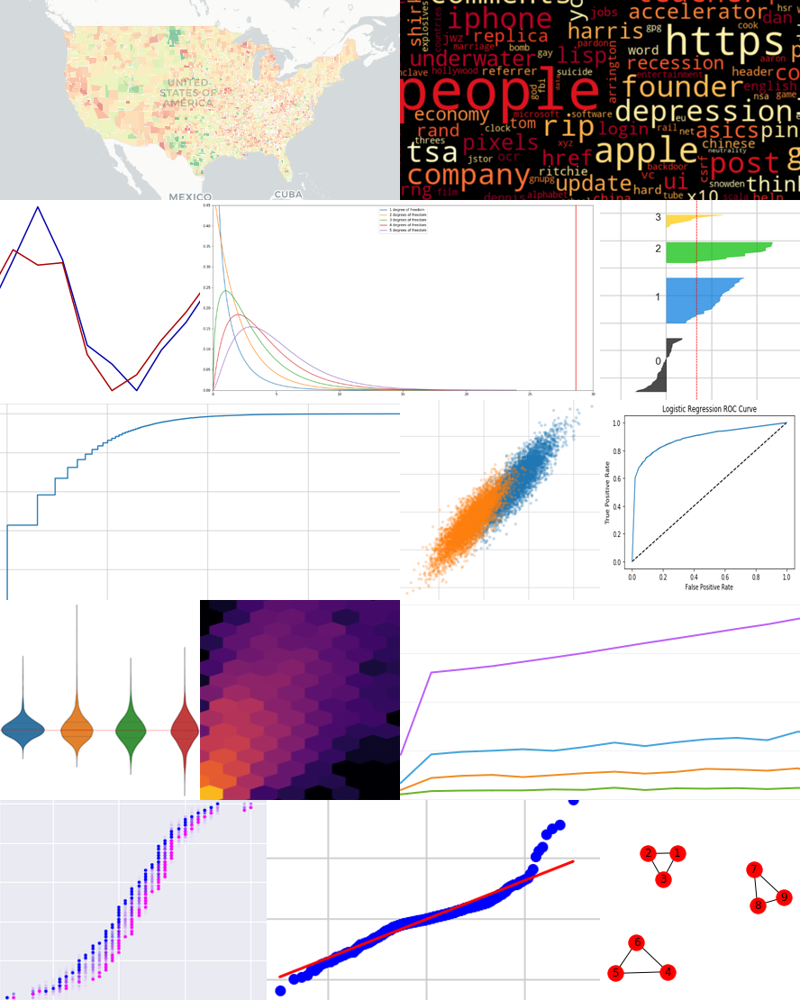

# Hello! Welcome to my Data Science Porfolio
Below, find a list of exercises and projects that demonstrate my data science competency. Each of these projects required me to independently seek resources and understand new topics. A short description is available in the readme for each project, and Python Jupyter notebooks show my solutions. Enjoy!

 - [Capstone - Predicting US Economic Growth](Capstone%201)
 - [Capstone - Recommending Hacker News Content](Capstone%202)
 - [Take Home Assessment - Ridesharing Experiment](Other%20Projects%20and%20Exercises/Take%20Home%20-%20Ultimate%20Technologies%20Inc)
 - [Take Home Assessment - User Adoption](Other%20Projects%20and%20Exercises/Take%20Home%20-%20Relax%20Inc)
 - [Statistics - Racial Discrimination](Other%20Projects%20and%20Exercises/Statistics%20-%20Racial%20Discrimination)
 - [Statistics - Human Temperature](Other%20Projects%20and%20Exercises/Statistics%20-%20Human%20Temperature)
 - [Statistics - Hospital Readmissions](Other%20Projects%20and%20Exercises/Statistics%20-%20Hospital%20Readmissions)
 - [Spark MapReduce - Shakespeare](Other%20Projects%20and%20Exercises/Spark%20MapReduce%20-%20Shakespeare)
 - [SQL Analysis - Yammer](Other%20Projects%20and%20Exercises/SQL%20Analysis%20-%20Yammer)
 - [Naive Bayes - Predicting Movie Ratings](Other%20Projects%20and%20Exercises/Naive%20Bayes%20-%20Predicting%20Movie%20Ratings)
 - [Logistic Regression - Heights and Weights](Other%20Projects%20and%20Exercises/Logistic%20Regression%20-%20Heights%20and%20Weights)
 - [Linear Regression - Boston Housing](Other%20Projects%20and%20Exercises/Linear%20Regression%20-%20Boston%20Housing)
 - [Data Wrangling - World Bank Projects](Other%20Projects%20and%20Exercises/Data%20Wrangling%20-%20World%20Bank%20Projects)
 - [Clustering - Customer Segmentation](Other%20Projects%20and%20Exercises/Clustering%20-%20Customer%20Segmentation)
 
 Preview of some plots in this repository:

